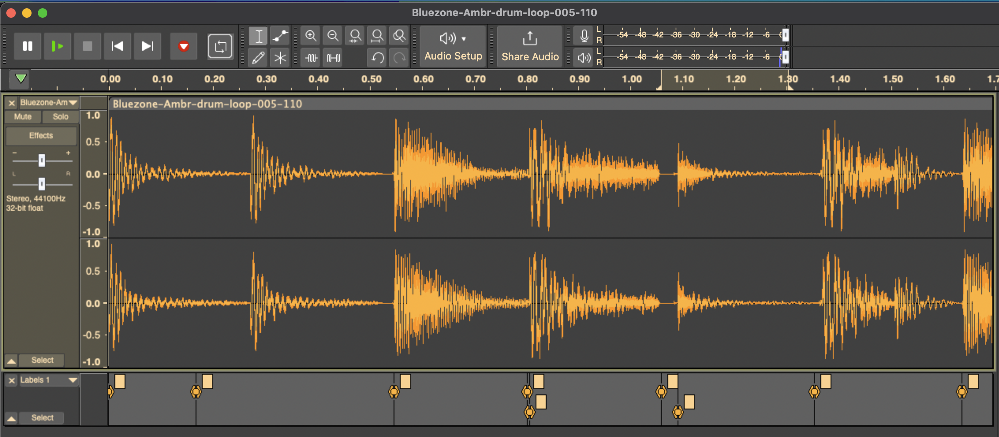

# Muzyka na samplach

## Spis treści
# Muzyka na samplach

## Spis treści
- [Wstęp](#wstęp)
  - [POKEY + Sample = ♥](#pokey--sample--)
  - [Ale jak to brzmi?](#ale-jak-to-brzmi)
- [Zrób to sam](#zrób-to-sam)
  - [Najpierw Software](#najpierw-software)
    - [Emulator Atari](#emulator-atari)
    - [Music Pro Tracker v24](#music-pro-tracker-v24)
    - [Audacity](#audacity)
    - [Sox](#sox)
    - [wav2digi](#wav2digi)
    - [atr](#atr)
  - [1 Przygotowanie sampli](#1-przygotowanie-sampli)
    - [Pozyskaj sample](#pozyskaj-sample)
    - [Obróbka](#obróbka)
    - [Przetwarzanie](#przetwarzanie)
  - [2 Konwersja sampli do formatów MPT](#2-konwersja-sampli-do-formatów-mpt)
- [Materiały uzupełniające](#matariały-uzupełniające)
  - [Źródła dobrej jakości sampli](#źródła-dobrej-jakości-sampli)
  - [PC DAW](#pc-daw)

---

## Wstęp
To jest przewodnik "po sznurku" - przez kwestie przygotowania sampli, konwersjii formatów, programowania muzyki   
po kompilację i uruchomienie na standardowym Atari XL/XE. Znajdziesz tu konkretne instrukcje, narzędzia, działające przykłady,  
kasusy użycia i próbki. Do dzieła!

### POKEY + Sample = ♥
Połączenie syntetycznego POKEY z brzmieniem sampli wzbogaca muzykę Atari o nową jakość. Samplowane zestawy perkusyjne,   
nuty basu z filtrem dolnoprzustowym, akordy, czy krótkie
fragmenty muzyczne (loopy) gotowe do odtwarzania w "pętli" eksponują 
muzyczne ambicje Atari na nowy poziom. 

### Ale jak to brzmi?
Trudno o tym pisać.. po prostu odpal [przykładowy utwór (.xex)](https://github.com/tonual/a8_mp_kitchensink/tree/main/mpt_samples_worklfow/xex) 
na swoim Atari i posłuchaj.  
Muzyczkę _transcil.xex_ wykonasz samodzilenie na podstawie tego przewodnika!


---

## Wstęp
To jest przewodnik "po sznurku" - przez kwestie przygotowania sampli, konwersjii formatów, programowania muzyki   
po kompilację i uruchomienie na standardowym Atari XL/XE. Znajdziesz tu konkretne instrukcje, narzędzia, działające przykłady,  
kasusy użycia i próbki. Do dzieła!

### POKEY + Sample = ♥
Połączenie syntetycznego POKEY z brzmieniem sampli wzbogaca muzykę Atari o nową jakość. Samplowane zestawy perkusyjne,   
nuty basu z filtrem dolnoprzustowym, akordy, czy krótkie
fragmenty muzyczne (loopy) gotowe do odtwarzania w "pętli" eksponują 
muzyczne ambicje Atari na nowy poziom. 

### Ale jak to brzmi?
Trudno o tym pisać.. po prostu odpal [przykładowy utwór (.xex)](https://github.com/tonual/a8_mp_kitchensink/tree/main/mpt_samples_worklfow/xex) 
na swoim Atari i posłuchaj.  
Muzyczkę _transcil.xex_ wykonasz samodzilenie na podstawie tego przewodnika!

## Zrób to sam

### Najpierw Software 

#### Emulator Atari
Szkoda zużywać klawiatury wiekowego staruszka... wykorzystaj emulator do pracy. Na deser zawsze 
można sprawdzić efekt na prawdziwym sprzęcie.
- [Altirra](https://www.virtualdub.org/altirra.html)
- [Atari800](https://github.com/atari800/atari800)

#### Music Pro Tracker v2.4
[MPT ](http://atariki.krap.pl/index.php/Music_Protracker) jest doskonałym trackerem do pracy z samplami na Atari XL/XE zwłaszcza,   
z uwagi na dostępny odtwarzacz zarówno wersji na Assemlber jak i __Mad Pascal__.

Kilka faktów:
- 1 kanał przeznaczony na granie samplami
- max 16 różnych sampli
- częstotliwość próbkowania to 15Khz lub 8Khz, w rozdzielczości 4bit, mono
- max rozmiar sampli ~11Kb (według mojego doświadczenia)
- max czas sampla 3.4s (według mojego doświadczenia)
- możliowść załadowania wielu sampli jednocześnie z jednego pliku
- format pliku sampli: .d8 (8KHz), .d15 (15Khz)

[Pobierz MPT obraz dyskietki](http://atariki.krap.pl/images/4/4b/Mpt24s_and_docs.ATR)

#### Audacity
Darmowy, wieloplatformowy (Win, OSX, Linux) program do pracy z samplami - posiada komplet narzędzi wymaganych na potrzeby  
pocesu obróbki i przygotowania sampli da dalszej pracy.

[Pobierz Audacity](https://www.audacityteam.org/download/)

#### Sox
Szwajcarski scyzoryk wśród narzędzi do przetwarzania dźwięku z linii poleceń. 
Może konwertować pliki audio na inne popularne formaty oraz stosować efekty i filtry dźwiękowe podczas konwersji. 
Wieloplatformowy (Win, OSX, Linux).

[Pobierz Sox](https://sourceforge.net/projects/sox/)

#### wav2digi
Program linii poleceń, konwertuje plik/pliki WAV do .d8 lub .d15 oraz wypisuje statystyki. Dostępne wersje w językach   
wysokiego poziomu: _Python, C#, Java._ Napisany przez GPT.  
Kluczowymi informacjami o wymaganiach podzielił się @tebe [w dyskusji na forum atarionline](https://atarionline.pl/forum/comments.php?DiscussionID=7975page=1#Item_39)

[Pobierz wav2digi](https://github.com/tonual/a8_mp_kitchensink/tree/main/mpt_samples_worklfow/utils)

#### atr
Program linii poleceń do manipulacji obrazami dyskietki Atari czyli plikami .atr
Pozwala min. wylistować zawartość dyskietki, dodać plik, usunąć plik.

[Pobierz atr](https://github.com/jhallen/atari-tools)


### 1. Przygotowanie sampli

#### Pozyskaj sample

Pobierz [darmowe sample](https://www.bluezone-corporation.com/images/FREE_SOUNDS/Bluezone_Corporation_Free_Chillout_Sample_Pack.zip), 
rozpakuj pliki i otwórz konkretnie plik __Bluezone-Ambr-drum-loop-005-110.wav__ w Audacity

#### Obróbka 
Odsłuchaj, to sewkencja perkusyjna z *base drum*, *snare*, *hihat* itd. Wedle uznanie zaznacz markerami interesujące fragmenty 
- kliknij na pozycję aby umieścić kursor a następnice __CTRL + B__. 
Pomozniczno powiększaj/oddalaj - __CTRL + scroll myszy__.



```
Idealnie kiedy fragment zaczyna się i kończy w miejscu, gdzie amplituda jest zerowa.  
Należy postarać się, aby fragment był jak najkrótszy a jednocześnie zachował sens swojego brzmienia.  
Dlatego warto zrobić wygaszenie lub wejście sygnału na ambplitudę ręcznie.
```
- Zaznacz myszą krótki fragment w miejscu początkowego markera i zastosuj __Effects -> Fading -> Fade in__
- Zaznacz myszą krótki fragment przed końcowym markerem i zastosuj __Effects -> Fading -> Fade out__  


#### Przetwarzanie
- zaznacza cały obszar: __CTRL + A__
- _menu: Effect -> Volume and Compression -> Compresor_ | ustaw: *Threshold -20dB, Ratio 10:1* | Apply
- _menu: Tracks -> Mix -> Mix Stereo Down to Mono_
- _menu: Tracks -> Resample_ | wpisz 15000 | OK
- _menu: Effect -> Volume and Compression -> Normalize_ | ustaw: 0dB | Apply
- _menu: File -> Export -> Export Mulitple_ | ustaw: format WAV, enconding: Unsigned 8-bit PCM | Export

Ostatnie polecenie zapisuje pociąte fragmenty do osobnych plików .wav.
Przesłuchaj dźwięki, usuń pliki z odkrawkami.

### 2. Konwersja sampli do formatów MPT

Wybierz środowisko uruchomieniowe dla konwertera. Do wyboru Pyhton, .NET lub Java.
[wav2digi](https://github.com/tonual/a8_mp_kitchensink/tree/main/mpt_samples_worklfow/utils)  
Wyselekcjonowane pliki .wav z samplami przygotowane w poprzednim kroku , powinny znajdować się w dedykowanym __katalogu__

```
wav2digi katalog_z_wav nazwapliku.d15
```
Rozszerzenie .d15 stosujemu kiedy sample mają 15Khz, .d8 kiedy 8Khz.  
Istnieje eksperymentalna możliwość podania adresu pamięci do załadowania sampli.

Objaśnienie formatu linii poleceń.
```
usage: wav2digi.py [-h] [--start-addr START_ADDR] input_paths [input_paths ...] output_file
```

```
Rozmiar danych pojedyńczego sampla powinien być wielkrotnością liczby 256. Jeśli nie wypełnia tego obszaru, 
zostanie zastosowany "pusty dopełniacz". Dlatego przełącz Audacity w jednostkę miary czasu "samples"
i sprawdź, czy długość sampla spełnia to wymaganie. Dzięki temu wywalczysz dodatkowe miejsce na sample!.
```

## Matariały uzupełniające

### Źródła dobrej jakości sampli.

- [Modular drums](https://cdn.mos.musicradar.com/musicradar-modular-percussion-samples.zip)
- [Hard Techno](https://www.bluezone-corporation.com/images/FREE_SOUNDS/Bluezone_Corporation_Free_Hard_Techno_Sample_Pack.zip)
- [Minimal Techno](https://www.bluezone-corporation.com/images/FREE_SOUNDS/Bluezone_Corporation_Free_Minimal_Techno_Sample_Pack.zip)
- [Psytrance](https://www.bluezone-corporation.com/images/FREE_SOUNDS/Bluezone_Corporation_Free_Psytrance_Sample_Pack.zip)

### PC DAW

Gorąco polecam do wypróbowania pakietu Digital Audio Workstation w postaci programu Ableton.
Zestaw obok bogatej biblioteki sampli wszelakiej maści a zwłaszcza perkusji, oraz "loopów" - posiada
liczne narzędzia do tzw "masteringu" czy modyfikacji brzmienia. 
Istniej przystępna, podstawowa wersja - Ablteon Live Lite (klucz można nabyć za symboliczną kwotę)

[Ableteon Live Lite](https://www.ableton.com/en/products/live-lite/)
