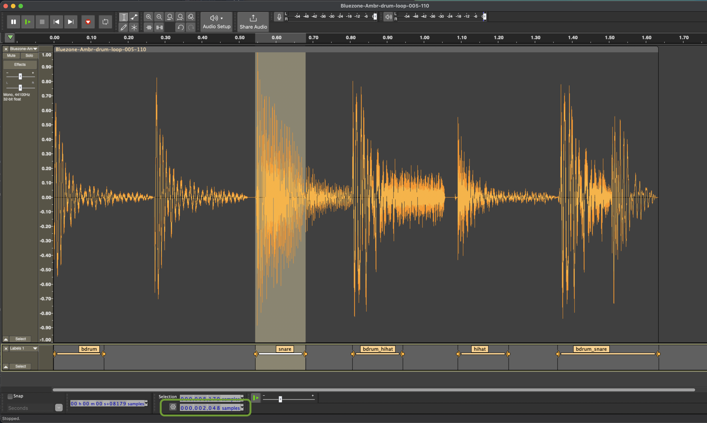
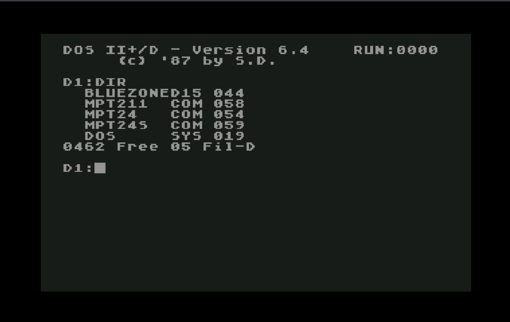
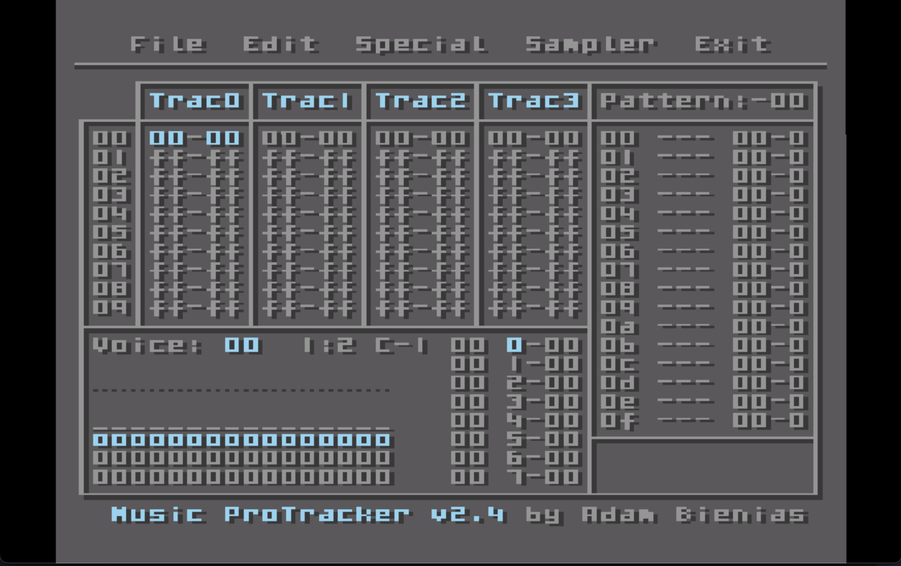
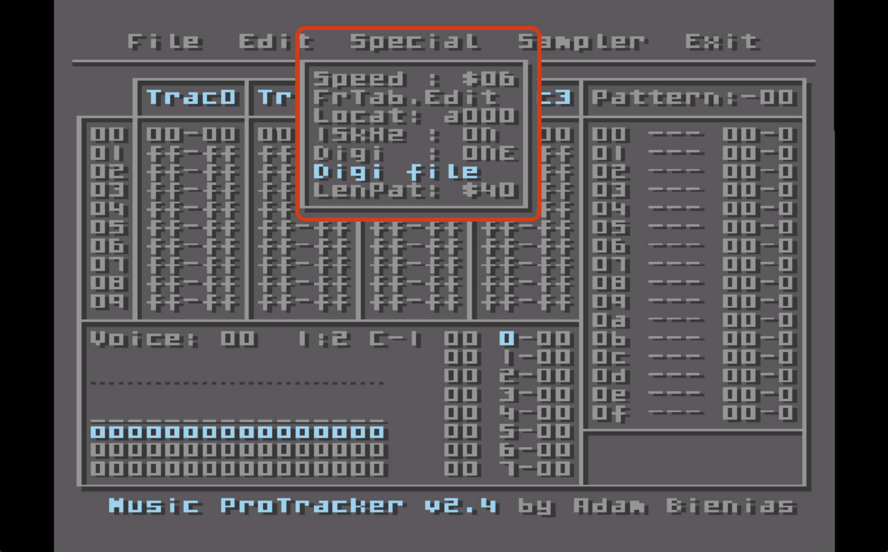
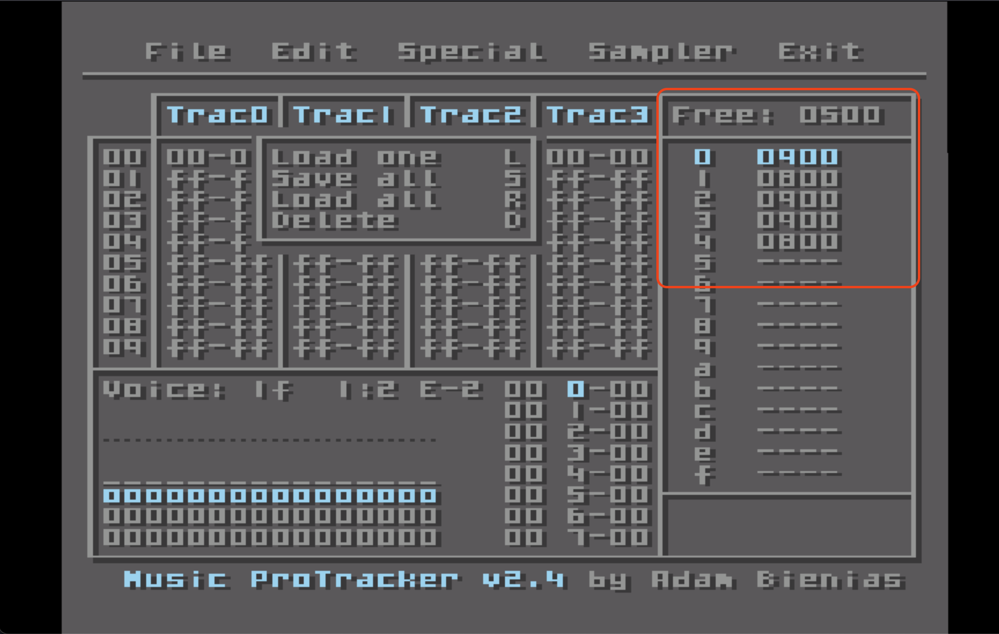
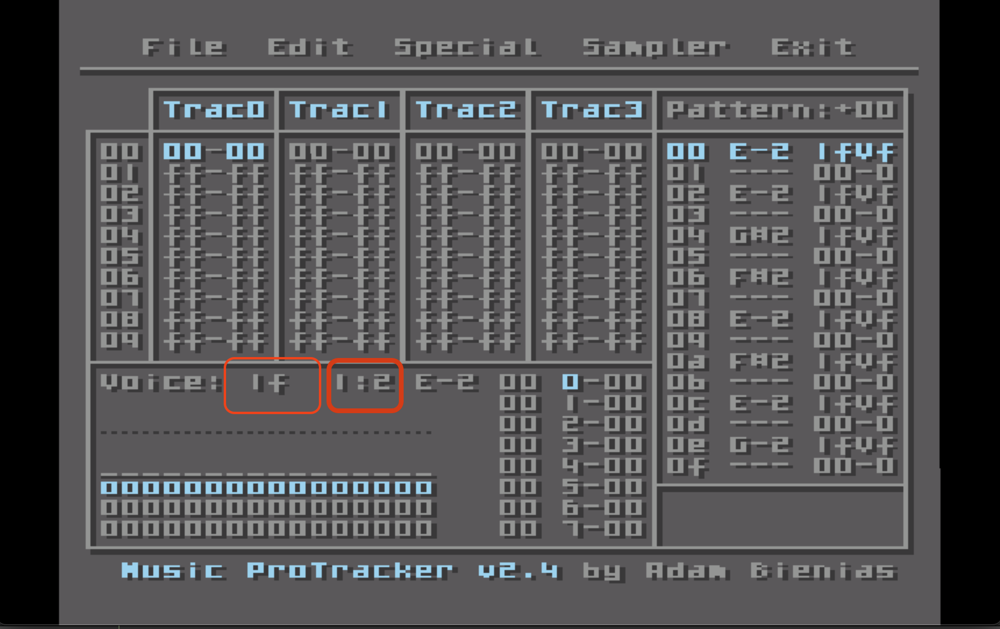
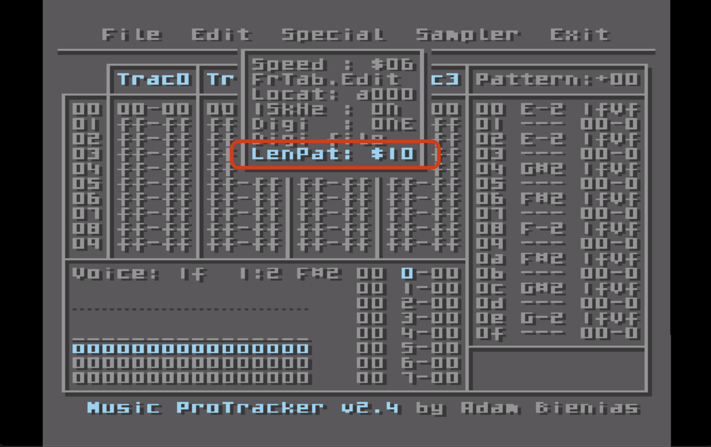
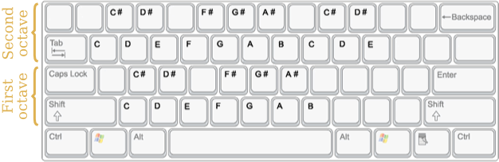
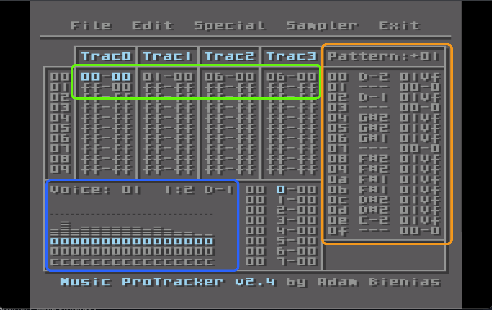
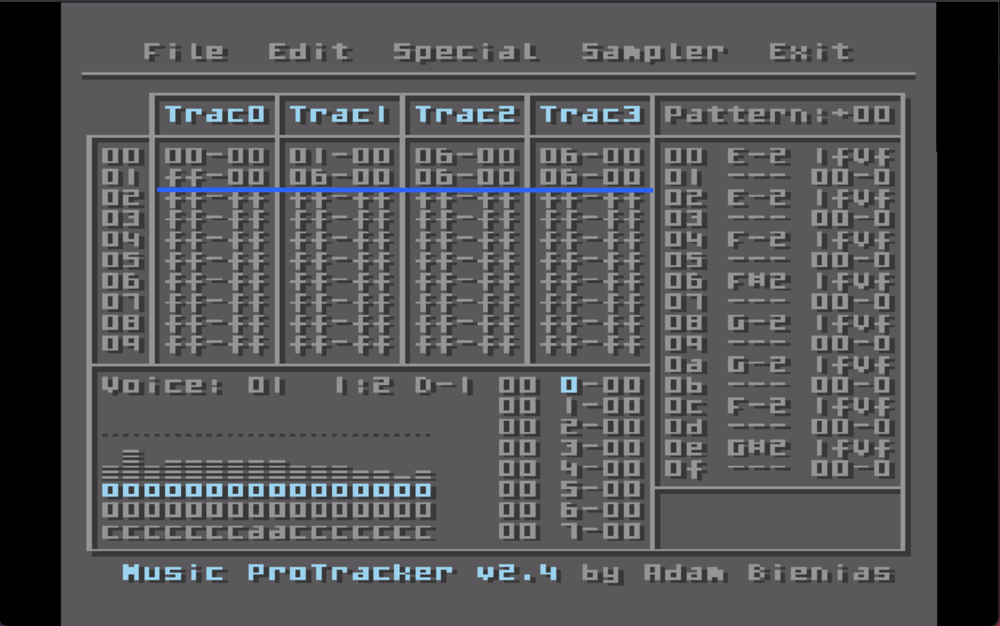

# Muzyka na samplach

# Spis treści

- [Wstęp](#wstęp)
  - [POKEY + Sample = ♥](#pokey--sample-)
  - [Ale jak to brzmi?](#ale-jak-to-brzmi)
- [Zrób to sam](#zrób-to-sam)
  - [Najpierw Software](#najpierw-software)
    - [Emulator Atari](#emulator-atari)
    - [Music Pro Tracker v2.4](#music-pro-tracker-v24)
    - [Audacity](#audacity)    
    - [wav2digi](#wav2digi)
    - [atr](#atr)
    - [Free Pascal, Mad Assembler, Mad Pascal](#free-pascal-mad-assembler-mad-pascal)
  - [Przygotowanie sampli](#przygotowanie-sampli)
    - [Pozyskaj sample](#pozyskaj-sample)
    - [Obróbka](#obróbka)
    - [Obowiązkowe przetwarzanie](#obowiązkowe-przetwarzanie)
  - [Konwersja formatów MPT](#konwersja-formatów-mpt)
    - [Linia poleceń](#linia-poleceń)
    - [Omówienie statystyk](#omówienie-statystyk)
  - [Obraz dyskietki](#obraz-dyskietki)
  - [Praca z MPT na emulatorze](#praca-z-mpt-na-emulatrze)
  - [Ładowanie sampli w MPT](#ładowanie-sampli-w-mpt)
  - [Zagrajmy samplami](#zagrajmy-samplami)
  - [Dla kozery, dodajmy basik](#dla-kozery-dodajmy-basik)
  - [Zapisujemy utwór i wyciągamy z obrazu .atr](#zapisujemy-utwór-i-wyciągamy-z-obrazu-atr)
  - [Tworzymy plik uruchamialny .xex](#tworzymy-plik-uruchamialny-xex)
- [Źródła dobrej jakości sampli](#źródła-dobrej-jakości-sampli)
- [PC DAW](#pc-daw)


---

## Wstęp
To jest przewodnik "po sznurku" - od kwestii przygotowania sampla, konwersjii formatów, programowania muzyki   
po kompilację i uruchomienie na standardowym Atari XL/XE. Znajdziesz tu konkretne instrukcje, narzędzia, działające przykłady, kasusy użycia i próbki. Do dzieła!

### POKEY + Sample = ♥
Połączenie syntetycznego POKEY z brzmieniem sampli wzbogaca muzykę Atari o nową jakość. Samplowane zestawy perkusyjne,   
nuty basu z filtrem dolnoprzustowym, akordy, czy krótkie
fragmenty muzyczne (loopy) gotowe do odtwarzania w "pętli" eksponują 
muzyczne ambicje Atari na nowy poziom. 

### Ale jak to brzmi?
Trudno o tym pisać.. po prostu odpal [przykładowy utwór (.xex)](https://github.com/tonual/a8_mp_kitchensink/tree/main/mpt_samples_worklfow/xex) 
na swoim Atari i posłuchaj.  
Muzyczkę _transcil.xex_ wykonasz samodzilenie na podstawie tego przewodnika!

## Zrób to sam

### Najpierw Software 

#### Emulator Atari
Szkoda zużywać klawiatury wiekowego staruszka... wykorzystaj emulator do pracy. Na deser zawsze 
można sprawdzić efekt na prawdziwym sprzęcie.
- [Altirra](https://www.virtualdub.org/altirra.html)
- [Atari800](https://github.com/atari800/atari800)

#### Music Pro Tracker v2.4
MPT jest doskonałym _trackerem_ autorstwa Adama Bieniasa. Program powstał na początku złotych lat 90tych.  
Tracker obsługuje digitalizowane sample __(digi)__ już na podstawowym Atari XL/XE. Format pliku z muzyką to .md1 (.md2),  
natomiast sample przechowywane są w osobnym pliku (.d8, .d15). Warto zwrócić uwagę na dostępne, kompaktowe   
odtwarzacze muzyki z formatu .md1, zarówno wersji Assemlber jak i __Mad Pascal__ (oczywiście ze wsparciem sampli)

Kilka faktów:
- max 2 kanały przeznaczone na granie samplami *ten przewodnik dotycz 1 kanału
- max 16 różnych sampli
- częstotliwość próbkowania: 15Khz lub 8Khz, 4bit, mono
- możliowść załadowania wielu sampli jednocześnie z jednego pliku
- formaty pliku z samplami: .d8 (8KHz), .d15 (15Khz)
- max rozmiar pliku z samplami ~11Kb _*według mojego doświadczenia_
- max czas sampla 3.4s _*przy 8Khz, według mojego doświadczenia_

[Więcej faktów o MPT](http://atariki.krap.pl/index.php/Music_Protracker) 

#### Audacity
Darmowy, wieloplatformowy (Win, OSX, Linux) program do pracy z samplami - posiada komplet narzędzi wymaganych na potrzeby  
pocesu obróbki i przygotowania sampli da dalszej pracy.

[Pobierz Audacity](https://www.audacityteam.org/download/)

#### wav2digi
Program linii poleceń, konwertuje plik/pliki WAV do .d8 lub .d15 oraz wypisuje statystyki. 
Python, napisany przez GPT. Jeśli potrzbujesz wariant w innych językach wysokiego poziomu jak _C#, Java._ to
GPT z łatwością przekonwertuje.  Kluczowymi informacjami o wymaganiach podzielił się @tebe [w dyskusji na forum atarionline](https://atarionline.pl/forum/comments.php?DiscussionID=7975page=1#Item_39)

[Pobierz wav2digi](https://github.com/tonual/a8_mp_kitchensink/blob/main/mpt_samples_worklfow/utils/wav2digi.py)

#### atr
Program linii poleceń do manipulacji obrazami dyskietki Atari czyli plikami .atr
Pozwala min. wylistować zawartość dyskietki, dodać plik, usunąć plik.  
Podaję link to kodu źródłowego, zatem należ samodzielnie skompilować program dla swojego systemu.  
Wystraczy zainstalować kompilator języka C, i uruchomić z linii poleceń:
```
gcc atr.c
```
[Pobierz atr](https://github.com/jhallen/atari-tools/archive/refs/heads/master.zip)  
[Dokumentacja](https://github.com/jhallen/atari-tools)

#### Free Pascal, Mad Assembler, Mad Pascal
Te narzędzie będą potrzebne, jeśli planujesz wykorzystać muzykę na samplach w swoim programach,  
lub po prostu chcesz odtworzyć ją bez używanie programu _Music Pro Tracker_ w postaci pliku uruchamialnego .xex.  
_Free Pascal_ (wybierz wersję dla Twojego systemu) jest potrzebny aby skompilować _Mad Assembler_ i _Mad Pascal_, później już z górki.

[Free Pascal download](https://www.freepascal.org/download.html)  
[MAD ASSEMBLER download](https://github.com/tebe6502/Mad-Assembler/archive/refs/heads/master.zip)  
[MAD PASCAL download](https://github.com/tebe6502/Mad-Pascal/archive/refs/heads/master.zip)  

### Przygotowanie sampli

#### Pozyskaj sample

Pobierz [darmowe sample](https://www.bluezone-corporation.com/images/FREE_SOUNDS/Bluezone_Corporation_Free_Chillout_Sample_Pack.zip), 
rozpakuj pliki i otwórz konkretnie plik __Bluezone-Ambr-drum-loop-005-110.wav__ w Audacity

#### Obróbka.
Odsłuchaj, to sewkencja perkusyjna z *base drum*, *snare*, *hihat* itd.  

Ustaw próbkowanie na 15Khz lub 8Khz: 
>Audacity -> Preferences -> Audio Settings -> Project Sample Rate: (other)  

Ustaw jednostkę miary czasu na _"samples"_ 
> Dolne lewy róg ekranu (zielona ramka) 

Zaznacz myszą fragment sampla i upewnij się, że długość zaznaczenia to wielokroność liczby 256.  
Aby zrobić to dokładnie, zaznacz myszą "mnie-więcej", a nastpęnie podaj z klawiatury wartość dla "samples".  
Następnie utwórz marker z zaznaczania  __CTRL + B__ opcjonalnie wpisz nazwę zaznaczenia.

`Pomozniczno powiększaj/oddalaj - __CTRL + scroll myszy__.`




>Idealnie kiedy fragment zaczyna się i kończy w miejscu, gdzie amplituda jest zerowa.  
>Należy postarać się, aby fragment był jak najkrótszy a jednocześnie zachował sens swojego brzmienia.  
>Dlatego warto zrobić wygaszenie lub wejście sygnału na ambplitudę ręcznie.

W tym celu:
>Zaznacz myszą krótki fragment w miejscu początkowego markera i zastosuj __Effects -> Fading -> Fade in__
>Zaznacz myszą krótki fragment przed końcowym markerem i zastosuj __Effects -> Fading -> Fade out__  

#### Obowiązkowe przetwarzanie
zaznacza cały obszar: __CTRL + A__
- _menu: Tracks -> Mix -> Mix Stereo Down to Mono_  

__Dla każdtegp fragmentu z osobna__ (doblue-click na markerze aby zanzaczyć fragment) nakładamy compresję i normalizujemy:
- _menu: Effect -> Volume and Compression -> Compresor_ | ustaw: *Threshold -20dB, Ratio 10:1* | Apply
- _menu: Effect -> Volume and Compression -> Normalize_ | ustaw: 0dB | Apply

Eksportujemy sample do wielu plików .wav
- _menu: File -> Export -> Export Mulitple_  

`
WAV | Unsigned 8-bit PCM
`


Ostatnie polecenie zapisuje pociąte fragmenty do osobnych plików .wav.

Przykład długości sampla aby mieścił się "w slocie" pamięci MPT bez paddingu  
>8 kHz:
>2048 samples = 0.256 s  
>4096 samples = 0.512 s  
>15 kHz:  
>2048 samples ≈ 0.1365 s  
>4096 samples ≈ 0.273 s
>

### Konwersja formatów MPT

#### Linia poleceń

Gwóźdź programu, zachowaj ostrożność.  
Wyselekcjonowane pliki .wav z samplami przygotowane w poprzednim kroku , powinny znajdować się w dedykowanym __katalogu_z_wav__  

```
wav2digi katalog_z_wav mojesample.d15
```
Rozszerzenie .d15 stosujemu kiedy sample mają 15Khz, .d8 kiedy 8Khz.   
Istnieje eksperymentalna możliwość podania adresu pamięci do załadowania sampli (na własną odpowiedzialność).  
Pełny format linii poleceń to:
```
wav2digi.py [-h] [--start-addr START_ADDR] input_paths [input_paths ...] output_file
```

#### Omówienie statystyk
Przykładowe działanie; w moim przypadku python, a katalog z samplami to _sample/bluezone_drum_ ([do pobrania](https://github.com/tonual/a8_mp_kitchensink/tree/main/mpt_samples_worklfow/sample/bluezone_drum))

```
python3 utils/wav2digi.py sample/bluezone_drum bluezone.d15
Found 5 WAV files to process:
  - sample/bluezone_drum/01-bdrum.wav
  - sample/bluezone_drum/02-snare.wav
  - sample/bluezone_drum/03-bdrum_hihat.wav
  - sample/bluezone_drum/04-hihat.wav
  - sample/bluezone_drum/05-bdrum_snare.wav
Processed sample/bluezone_drum/01-bdrum.wav: 2048 PCM samples → 2048 4-bit → 1024 bytes (padded 0, final 1024)
Processed sample/bluezone_drum/02-snare.wav: 2048 PCM samples → 2048 4-bit → 1024 bytes (padded 0, final 1024)
Processed sample/bluezone_drum/03-bdrum_hihat.wav: 2048 PCM samples → 2048 4-bit → 1024 bytes (padded 0, final 1024)
Processed sample/bluezone_drum/04-hihat.wav: 2048 PCM samples → 2048 4-bit → 1024 bytes (padded 0, final 1024)
Processed sample/bluezone_drum/05-bdrum_snare.wav: 4096 PCM samples → 4096 4-bit → 2048 bytes (padded 0, final 2048)
Created bluezone.d15 with 5 samples.
Sample addresses: ['$9000', '$9400', '$9800', '$9c00', '$a000']
Sample lengths: ['1024 bytes', '1024 bytes', '1024 bytes', '1024 bytes', '2048 bytes']
Total file size: 6176 bytes
```
W wyniku działania konwertera powstał plik bluzone.d15 w którym znajduje się 5 sampli.  

Statystyki pokazują wynik działania konwersji. Istotne jest aby nie wystąpiło "dopełniania" (padding).
Długość sampli wyrażają się liczbą która jest wielokrotnośćią 256 (1024, 2048, 4096 itd).

### Obraz dyskietki

W tym kroku stworzymy obraz dyskieti Atari z samplami (plik .d15), programem MPT oraz DOSem.  
Ponieważ sample będą ładowane z poziomu programu MPT, DOS jest niezbędny i będzie wspierał operacje odczytu/zapisu.

Pobież [gotowy obrazu dyskieti .atr](https://github.com/tonual/a8_mp_kitchensink/blob/main/mpt_samples_worklfow/atr/dos_mpt.atr), który ma już DOSa i MPT. Wystarczy zatem wrzucić pliki sampli.  
Wcześniej krótka rozgrzewka - wylistuj pliki w obrazie:
```
atr dos_mpt.atr ls
```
W wyniku polecenia dostajesz listę plików w obrazie: _mpt211.com mpt24.com mpt24s.com_  (3 różne wersje programu MPT)  

Dodajmy plik z samplami do obrazu:
```
atr dos_mpt.atr put bluezone.d15
```

[Składnia linii poleceń atr](https://github.com/jhallen/atari-tools?tab=readme-ov-file#atr-syntax)

### Praca z MPT na emulatrze

Przygotowany obraz dyskiet atr. Odpalamy w emulatorze Atari. Najprościej jest "przeciągnąć" myszką plik .atr
na okno emulatora.  
Spowoduje to automatyczne załadowanie obrazu dyskietki na emulatorze i odpali się DOS.    
Wpisujemy komendę __DIR__ i _ENTER_ - dostajemy listę plików.
```
DIR
```


Odpalamy program MPT. Ten przewodnik uwzględnia popularną wersję 2.4.    
(Wersja 2.4S obłusguje stereo, a 2.11 dorzucona jest dla towarzystwa)  
Czyli wpisujemy nazwę pogramu __MPT24__ i _ENTER_
```
MPT24
```
  

Nacieszmy się chwilę prostym a zarazem praktycznym interfejsum użytkownika.   
Od tej chwili myszkę można odsunąć..dalej od siebie.

### Ładowanie sampli w MPT

Interfejs użytkownika dzieli się na 3 sekcje: Song(Trac0 Track1 Trac2 Trac3), Pattern, Voice oraz górne menu (File Edit Special Sampler Exit).  
Między oknami poruszamy się naciskając __TAB__. Migający kursor informuje, w którym oknie aktualnie się znajdujemy.

Załadujmy nasze sample.  
Z dowolnego okna, do górnego menu przechodzimy naciskająć __CTRL + TAB__ , a następnie   
strzałkami ← → wybieramy __Special__ i naciskamy _ENTER_  
Teraz strzałkami ↑  ↓ poruszmay się po opcjach i wybieramy klawiszem _ENTER_ ustawienia:  

```
15Khz:  ON  
Digi:   ONE
```
  

Następnie wybieramy __Digi file__ i _ENTER_. Pojawia się kontekstowe okno z opcjami IO.  
Naciskamy klawisz __R__ czyli _"Load All"_
```
Load one  L
Save all  S
Load all  R
Delete    D
```
Teraz wpisujemy nazwę pliku z naszymi samplami i _ENTER_, czyli
```
BLUEZONE.D15
```
Teraz opuszczamy menu naciskając __ESC__, __ESC__.
Sample 

>Wartości heksadecymalne wyświetlane w widoku sampli reprezentują spakowaną długość każdego zdigitalizowanego sampla   
>w bajtach, pokazaną w formacie szesnastkowym (z bajtem starszym na początku, tj. w kolejności big-endian). Długości te  
>dpowiadają przestrzeni zajmowanej przez dane sampla po ich konwersji do formatu PCM 4-bitowego i spakowaniu   
>(dwie próbki 4-bitowe na bajt), łącznie z ewentualnym dopełnieniem (padding), aby zapewnić wyrównanie do granic stron pamięci  
>o wielkości 256 bajtów.  
>
>0900 hex = 2304 bajty dziesiętnie (spakowane) — 1,3, i 4 sample: po 2304 bajty każdy.  
>0800 hex = 2048 bajtów dziesiętnie (spakowane) — 2 i 5 sample: po 2048 bajtów każdy.  
„Free: 0500” u góry oznacza pozostałą wolną pamięć (w bajtach, w formacie szesnastkowym).

  

### Zagrajmy samplami

Klawiszem __TAB__ przechodzimy do okna _Voice_.  
Następnie strzałkami ← → ustawiamy wartość Voice: na __1f__  
Pod tym numerem mamy dostęp na naszym sampli.
Na wszelki wypadek upewniamy się, oktawy ustawione są na __1:2__.  
(W razie czego, bedąc w oknie _Voice_ można to zmienić srzałkami ↑  ↓)
```
1f
```


Kolejno przechodizmy do okna _Pattern_ klawiszem __TAB__ i wpisujemy sekwencje - kolejno litery odpowiedające nutą.  
Pod każdą z tych nut, zmapowany jest pojedyńczy sample.  
Znaki klawiatury odpowiadają nutą, zapis wygląda tak (cyfra 2 przy nucie to numer oktawy):
Wpisujemy:
```
'E'       (E 2)   bass drum
spacja
'E'       (E 2)   bass drum
spacja
'6'       (G# 2)  snare
spacja
'5'       (F# 2)  hihat
spacja
'R'       (F 2)   bass drum + hihat
spacja
'5'       (F# 2)  hihat
spacja
'E'       (E 2)   bass drum
spacja
'G'       (G 2)   bass drum + snare seq
```
Aby przenieść kursor na wybraną nutę, poruszamy się srzałkami ↑  ↓  
__SHIFT+Del__ usuwa zaznaczoną nutę, a __SHIFT+Ins__ wstawia puste miejsce.  
Przesuńmy kursor na początek i odtwórzymy pattern __CTRL + P__  
Zatrzymaj odtwarzanie z __SHIFT + P__  
(w razie czego strzałki ← → zmieniają numer aktualnie edytowanego patternu)

Ponieważ wprwadziliśmy tylko kilka nut, a długość taku jest o wiele dłuższa, wejdźmy do menu __CTR + TAB__  
 ← → _Special_ __ENTER__ ↑  ↓ _LenPat_ __ENTER__ i ustawmy długość taktu na 10 - strzałki ↑  ↓  i __ENTER__  
 Wychodzimy __ESC__, __ESC__



### Dla kozery, dodajmy basik

Wracamy do edycji __Voice__ (niebieska ramka).  
Strzałkami  ← →  ustawiamy numer 01 (numer instrumentu), i przechodzimy do jego edycji __CTRL + E__  
Teraz po licznych pozycjach ustawień poruszamy się strzałkami ← → ↑  ↓ 

Twoim zadaniem jest odwzorowanie ustwień z obrazka (kolorwe ramki). Kluczowa wartość to litera _"c"_ w dolnym rzędzie.  
"Poziome paski" w 16 pozycjach to obwiednia głośności, czyli funkcja głośności instrumentu w czasie.  
Zmieniamy pozycję kursora na obwiedni strzałkami ← →, a następnie __CTR: + '-'__ lub __CTR: + '+'__ podbijamy lub ściszamy.  
Z edycji instrumentu wychodzimy zatiwerdzając  - __ENTER__

Teraz deser - pograjmy sobie tym instrumentem! Poniej mapowanie klawiatry na dźwięki.  
>credits www.music-tracker-online.com



Teraz zapiszmy swoje nuty i zagrajmy razem z perkusją. Przechodzimy __TAB__ do Pattern,  
strzałkami ← → ustawimy wolny slot czyli 01 i wpisujmey nutki (pomarńczowa ramka).

Na koniec __TAB__ przechodzimu do widoku "kompozycji" (zielona ramka) i wprowadzamy:  
__Trac0__ to sample czyli _pattern 00_, nastpeni __Trac1__ to bas czyli _pattern 01_.  
Pozsotałe tracki (Trac2, Trac6) wypełniamy pustym patternem czyli np _06_.  
W linii 01 jest zapis _ff-00_. Pierwszy człon informuje tracker o __instrukcji skoku__, a 00 to pozaycja skoku (czyli początek)  

Gotowe! Zagrajmy przed zapisem __CTRL + P__ , __'P'__ a __SHIFT + P__   to zatrzymanie grajka.



### Zapisujemy utwór i wyciągamy z obrazu .atr

Teraz już z górki. Wchodzimy do menu __CTRL + TAB__ , strzałkami ← → wybieramy _File_ i __ENTER__.  
```
Load  - L 
Save  - S
```
Wybieramy 'S' (save), podajemy nazwę utworu z rozszerzeniem .md1 i __ENTER__ (dla ułatwienia, proponuję użyć nazwy sampli) 
>BLUEZONE.MD1
Utwór nagrał się na obrazie dyskietki .atr.  
Dla pewności wylistujmy pliki.  
```
atr dos_mpt.atr ls
```
Powinna być para, czyli:  
```
BLUEZONE.MD1
BLUEZONE.D15
```
Teraz wyciągamy go z obrazu .atr to lokalnego systemu plików za pomocą atrybuty _get_.
```
atr dos_mpt.atr get bluezone.md1
```
### Tworzymy plik uruchamialny .xex

#### Zanim ruszysz dalej

No i mamy muzyczkę na samplach! Teraz użyjemy samodzilny "odtwarzacz" .md1 i zagramy bezpośrednio na Atari/emulatrze.  
Już bez potrzeby korzystania z programu MPT. Nuta na samplach doskonale nada się np. do planszy tytułowej gry.  

Wykorzystanie "zasobów" jest bardzo wysokie - odtwarzacz muzyki .md1 na samplach (1 kanał) korzysta   
z przerywania VBLANK i pożera większość cykli procesora.  

#### Player MD1 w assemblerze (MADS)

[Player assemblerowy](https://github.com/tonual/a8_mp_kitchensink/tree/main/mpt_samples_worklfow/asm)  
Autorem programu jest __Jaskier__

Player udostępnił i dodał komentarz @tebe  
[Dyskusja na forum atarionline](https://atarionline.pl/forum/comments.php?DiscussionID=7975&page=1#Item_39)

Oprócz .asm jest konieczny relokator pamięci (mmpt_relocator.mac)  
Sample ładowane są od adresu $9000, a muzyczki pod adres $a000 i kolidują z samplami. 
Stąd potrzeba relokacji.

Aby skompiliwać player ze swoim utworem/samplami, wystarczy zedytować plik asm w 3 miejscach: 

_linie 59-62_  
ldx #1 dla sampli w 15Khz, ldx #0 dla sampli w 8Khz
```
main
	lda #5		; sample
	ldx #1		; 1 - 15Khz ; 0 - 8Khz
	jsr init
```

n
_linie 969-971_
nazwa pliku .md1
```
msx	equ $5000
mpt_relocator 'muzyczka.md1' , msx
```  

_linie 990-992_
nazwa pliku .d15 / .d8 z samplami
```	
  org $9000
sample
	ins 'muzyczka.d15'
```

Gotowe, kompilujemy standardowym poleceniem  
`
mads "mpt_player.asm  -o:mpt_player.xex
`

#### Player MD1 w Mad Pascalu

[Mad Pascal i przykłady z .md1](https://github.com/tebe6502/Mad-Pascal/tree/master/samples/a8/sound/md1)  
[Repo tego przewodnika](https://github.com/tonual/a8_mp_kitchensink/tree/main/mpt_samples_worklfow/pas)

Tutaj sprawa jest prostsza i przyjemniejsza. 

W pliku md1_play.rc podajemy odpowiednio nazwę pliku z utworem (.md1) i z samplami (.d8, d15).
```
md1_modul	MD1	'nutamb.md1'
md1_sample	RCDATA	'nutamb.d8'
```

W pliku md1_play.pas decydujemy o jakości sampli ("true" dla 15Khz,false dla 8Khz)  
_linia 38_  
```
	repeat		
		msx.digi(false);
```
  
Kompilujemy standardowo najpierw Mad Pascalem do .a65  
`
mp md1_play.pas -ipath:scieżka_katalogu_lib_mad_pascala
`  
Następnie MAD'sem do .xex  
`
mads md1_play.a65 -x -i:scieżka_katalogu_base_mad_pascala -o:md1_play.xex
`

## Dodatkowe informacje

### Niuanse 

Jest tego pewnie sporo, ale chcę się podzielić jednym takim co zasiał ferment.  
Przygotowaując muzczykę na potrzeby tego przewodnika, wykorzystałem tylko pierwszą pozycję "00".   
W kolejnej linijce 01, ustawiłem rozkaz skoku z porwotem na pozycję "00", czyli "ff - 00".  

W edytorze MPT wszystko grało i hulało jak trzeba. Jednak kiedy skorzystałem z zewnętrznego odtwarzacza i   
uruchomiłem przygotowany plik .xex - cisza - chociaż program poprawnie się załadował...  
W monitorze emulatora zwórciłem uwagę na to, że POKEY nie jest wógle wykorzystywany, a kod zdaje się   
kroczyć w krótiej pętli.

Okazało się, że chociaż instrukcja skoku jest na Trac0, to nie można zostawiać pozostałych Trac'ów  
z wartościami __"ff-ff"__ co __odtwarzacz__ interpretuje jako natychmiastowy znacznik końca utworu   
z ujemną pozycją restartu.. edytor MPT nic sobie z tego nie robi. Stąd gruba zmyłka.

`
Jeśli w Track'u jest instrukcja skoku, pozostałe Trac'ki wypełnij pustym patter'nem.
`



### Instrukcja Music Pro Tracker

[Obraz dyskietki .atr z programem MPT oraz pełną instrukcją](http://atariki.krap.pl/images/4/4b/Mpt24s_and_docs.ATR)
Wystraczy skorzystać z programy _atr_ aby wydostać pliki z obrazu.

### Źródła dobrej jakości sampli.

- [Modular drums](https://cdn.mos.musicradar.com/musicradar-modular-percussion-samples.zip)
- [Hard Techno](https://www.bluezone-corporation.com/images/FREE_SOUNDS/Bluezone_Corporation_Free_Hard_Techno_Sample_Pack.zip)
- [Minimal Techno](https://www.bluezone-corporation.com/images/FREE_SOUNDS/Bluezone_Corporation_Free_Minimal_Techno_Sample_Pack.zip)
- [Psytrance](https://www.bluezone-corporation.com/images/FREE_SOUNDS/Bluezone_Corporation_Free_Psytrance_Sample_Pack.zip)

### PC DAW

Gorąco polecam pakiet _Digital Audio Workstation_ w postaci programu Ableton.  

<!-- @import "[TOC]" {cmd="toc" depthFrom=1 depthTo=6 orderedList=false} -->
Zestaw, obok __bogatej biblioteki sampli wszelakiej maści a zwłaszcza perkusji, oraz "loopów"   
posiada liczne narzędzia do tzw "masteringu" i spory wachlarz modułów modyfikacji brzmienia__.   
Jest sprytny, prosty w obłsudze a jednocześnie zaawansowany i posiada jedynie 2 widoki: aranżacji i kompozycji.   
Istniej przystępna, podstawowa wersja - Ablteon Live Lite (klucz można nabyć za symboliczną kwotę)

[Ableteon Live Lite](https://www.ableton.com/en/products/live-lite/)
