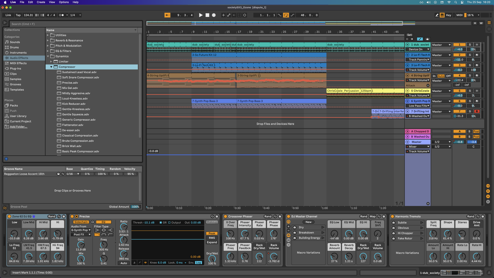

# Muzyka na samplach

## Table of Contents
- [Introduction](#introduction)
- [Section 1](#section-1)
  - [Subsection 1.1](#subsection-11)
  - [Subsection 1.2](#subsection-12)
- [Section 2](#section-2)
- [Conclusion](#conclusion)

---

## Wstęp
To jest przewodnik "po sznurku" - przez kwestie przygotowania sampli, konwersji formatów, 
programowania muzyki po kompilację i uruchomienie na standardowym Atari XL/XE. 
Znajdziesz tu konkretne instrukcje, narzędzie, gotowe przykłady, kasusy użycia i próbki.
Do dzieła!

### POKEY + Sample = ♥
Połączenie syntetycznego POKEY z brzmieniem sampli wzbogaca muzykę Atari o nową jakość.
Samplowane zestawy perkusyjne, nuty basu z filtrem dolnoprzustowym, akordy, czy krótkie
fragmenty muzyczne (loopy) gotowe do odtwarzania w "pętli" eksponują 
muzyczne ambicji Atari na nowy poziom. 

### Jak to wógle brzmi?
Trudno o tym pisać.. po prostu odpal [przykładowy utwór (.xex)](https://github.com/tonual/a8_mp_kitchensink/tree/main/mpt_samples_worklfow/xex) 
na swoim Atari i posłuchaj.

## Gramy na samplach

### Przygotuj Software 

#### Emulator Atari
Szkoda zużywać klawiatury wiekowego staruszka... wykorzystaj emulator do pracy. Na deser zawsze 
można sprawdzić efekt na prawdziwym sprzęcie.
- [Altirra](https://www.virtualdub.org/altirra.html)
- [Atari800](https://github.com/atari800/atari800)

#### Music Pro Tracker v2.4
[MPT ](http://atariki.krap.pl/index.php/Music_Protracker) jest doskonałym trackerem do pracy z samplami na Atari XL/XE zwłaszcza, z uwagi na dostępny odtwarzacz zarówno wersji na Assemlber jak i __Mad Pascal__.

Kilka faktów:
- 1 kanał przeznaczony na granie samplami
- max 16 różnych sampli
- częstotliwość próbkowania to 15Khz lub 8Khz, w rozdzielczości 4bit, mono
- max rozmiar sampli ~11Kb (według mojego doświadczenia)
- max czas sampla 3.4s (według mojego doświadczenia)
- możliowść załadowania wielu sampli jednocześnie z jednego pliku
- format pliku sampli: .d8 (8KHz), .d15 (15Khz)

[Pobierz MPT obraz dyskietki](http://atariki.krap.pl/images/4/4b/Mpt24s_and_docs.ATR)

#### Audacity
Darmowy, wieloplatformowy (Win, OSX, Linux) program do pracy z samplami - posiada komplet narzędzi wymaganych na potrzeby pocesu
obróbki i przygotowania sampli da dalszej pracy.

[Pobierz Audacity](https://www.audacityteam.org/download/)

#### 2. Sox - przygotowanie sampli
Szwajcarski scyzoryk wśród narzędzi do przetwarzania dźwięku z linii poleceń. 
Może konwertować pliki audio na inne popularne formaty oraz stosować efekty i filtry dźwiękowe podczas konwersji. 
Wieloplatformowy (Win, OSX, Linux).

[Pobierz Sox](https://sourceforge.net/projects/sox/)

#### wav2digi
Program linii poleceń, konwertuje plik/pliki WAV do .d8 lub .d15 oraz wypisuje statystyki. Dostępne wersje w językach wysokiego poziomu: Python, C#, Java. Napisany przez GPT. Kluczowe informacja o wymaganiach dostarczył @tebe [w dyskusji na forum atarionline](https://atarionline.pl/forum/comments.php?DiscussionID=7975page=1#Item_39)

[Pobierz wav2digi](https://github.com/tonual/a8_mp_kitchensink/tree/main/mpt_samples_worklfow/utils)

#### atr
Program linii poleceń do manipulacji obrazami dyskietki Atari czyli plikami .atr
Pozwala min. wylistować zawartość dyskietki, dodać plik, usunąć plik.

[Pobierz atr](https://github.com/jhallen/atari-tools)

## Plan działania
### Przygotowanie sampli dla MPT
1. Pozyskanie dobrej jakości sampli 
2. Normalizacja, dynamika i kompresja dźwięku
2. Przycięcie, zastosowanie "fade in/out" na początek/koniec.
3. Konwersja do mono, próbkowania w dół - 15Khz lub 8Khz 
4.

## 2. Matariały uzupełniające

### Źródła dobrej jakości sampli.

- [Modular drums](https://cdn.mos.musicradar.com/musicradar-modular-percussion-samples.zip)
- [Hard Techno](https://www.bluezone-corporation.com/images/FREE_SOUNDS/Bluezone_Corporation_Free_Hard_Techno_Sample_Pack.zip)
- [Minimal Techno](https://www.bluezone-corporation.com/images/FREE_SOUNDS/Bluezone_Corporation_Free_Minimal_Techno_Sample_Pack.zip)
- [Psytrance](https://www.bluezone-corporation.com/images/FREE_SOUNDS/Bluezone_Corporation_Free_Psytrance_Sample_Pack.zip)

### PC DAW

Gorąco polecam do wypróbowania pakietu Digital Audio Workstation w postaci programu Ableton.
Zestaw obok bogatej biblioteki sampli wszelakiej maści a zwłaszcza perkusji, oraz "loopów" - posiada
liczne narzędzia do tzw "masteringu" czy modyfikacji brzmienia. 
Istniej przystępna, podstawowa wersja - Ablteon Live Lite (klucz można nabyć za symboliczną kwotę)

[Ableteon Live Lite](https://www.ableton.com/en/products/live-lite/)

 

## Section 2
Describe the second major section here.

## Conclusion
Summarize the document and provide any final thoughts.